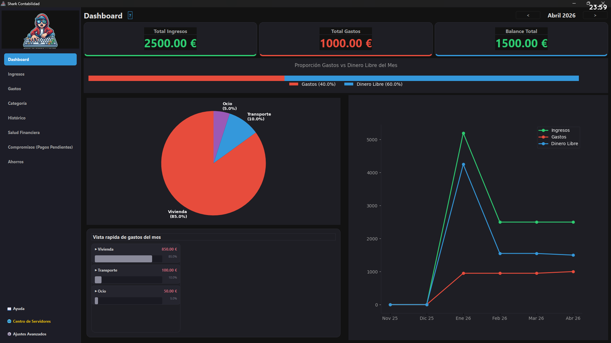
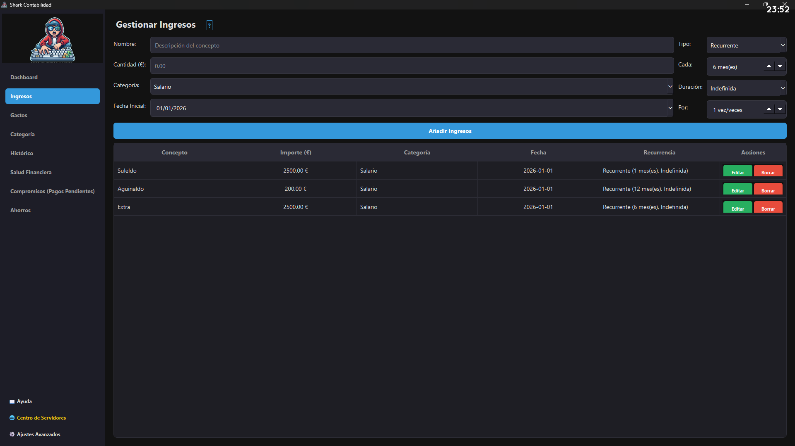
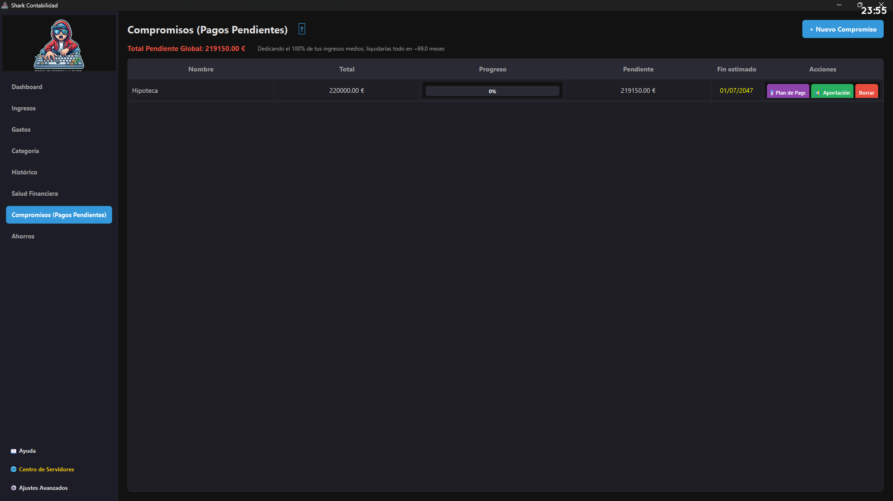
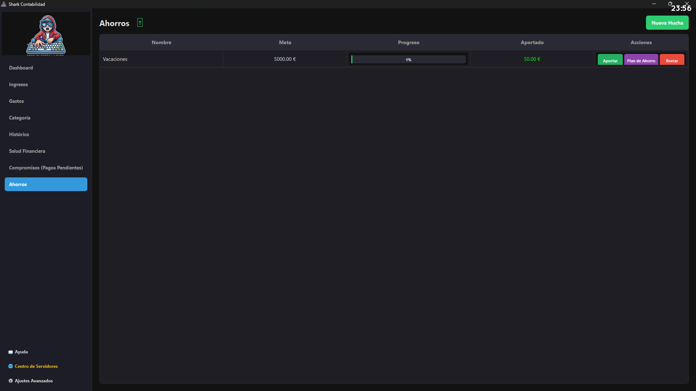

<h1 align="center">
  
  <br>
  Shark Contabilidad
</h1>

<p align="center">
  <strong>El gestor financiero hiper-seguro y versátil de Escritorio con despliegue Cloud PWA.</strong>
</p>

---

**Shark Contabilidad** es un administrador de presupuestos concebido para dar a los usuarios el rigor de la empresa profesional en sus finanzas domésticas diarias, blindado con un nivel de seguridad y criptografía que garantiza que los datos solo permanezcan legibles en el entorno del propietario legítimo.

## ✨ Características Principales

* **Dashboard Dinámico e Interactivo**: Gráfico de tarta avanzado con agrupación por categorías, etiquetas internas de porcentaje y tooltips informativos que desglosan los gastos individuales. Incluye selector de tendencias entre gráficos de Líneas o Barras.
* **Splash Screen Animada**: Nueva experiencia de inicio con video introductorio tras el login.
* **Edición Integral**: Capacidad para editar compromisos financieros, categorías y transacciones de forma quirúrgica.
* **Instalación Inteligente**: Generador de accesos directos para Escritorio y Menú Inicio en entornos Windows.
* **Cifrado Real AES-256**: Los campos de la base de datos (Ingresos, Gastos y Compromisos) no se guardan en texto plano. Están encriptados en crudo.

* **Sistema de Protocolo Seguro**: Autodestrucción completa de la base de datos local y su directorio maestro a prueba de hackeos (5 intentos fallidos de autenticación).
* **Compromisos y Planes de Pago**: No solo registras gastos pasados. El sistema de 'Compromisos' se adueña de tus deudas grandes o compras a plazos, calculando tu porcentaje pagado y el tiempo restante estimado matemáticamente para terminar tu deuda.
* **Huchas y Metas de Ahorro**: El reverso de los compromisos. Crea huchas con meta (ej: Viaje) o sin techo (ej: Fondo de Emergencia). Cada aportación cuenta como un gasto para tu bolsillo pero como un éxito para tu meta.
* **Regla Universal 50/30/20**: La app diagnostica tu salud económica asignando una puntuación automatizada mensual de 0-100 para evaluar si cumples el mítico equilibrio de Necesidades / Caprichos / Ahorro.s.
* **Portabilidad y Flexibilidad Extrema**: Exportación de bases de datos a almacenamiento externo (USB) capaz de reiniciarse en otra máquina y solicitar la clave original para revelar los balances.

## 📸 Vista Previa

<p align="center">
  
  
</p>
<p align="center">
  
  
</p>

## 📱 Server Integrado y PWA Web

Tu cliente de escritorio no está limitado al PC. Dispone de un hub interno **Centro de Servidores** que con un clic:
1. Despliega un Servidor `Flask` en background para meter gastos tumbado en el sofá con el móvil en la misma Red WiFi.
2. Genera un exportador de código `.zip`.
3. Ofrece un instalador Remoto (Zero-Touch) para inyectar un Contenedor Docker auto-gestionado de Shark en infraestructuras VPS de terceros vía `SSH`.

Una vez tengas tu servidor externo desplegado (Docker), disfrutarás de **Cloud Save Integrado**:
- **Sincronización Automática (Bidireccional)**: Cada vez que abras la aplicación en tu PC, los últimos movimientos que hayas hecho en el móvil (web) se descargarán. Todo lo que cambies en el Escritorio, volverá al Servidor al cerrar.

## 🛠 Instalación y Configuración

El proyecto está diseñado para desplegarse mediante `PyInstaller` como un único `.exe` si te encuentras en cliente Windows, o funcionar bajo el código fuente sin dependencias ocultas.

**Requisitos**: Python 3.10+ y PyQt6.

```bash
# Instalar dependencias
pip install -r requirements.txt
pip install -r requirements-web.txt

# Iniciar la App Nativa Local
python main.py

# Auto-Empaquetar App para distribución (Windows)
crear_ejecutable.bat
# O alternativamente: pyinstaller "Shark Contabilidad.spec" --clean -y

# Auto-Empaquetar App para distribución (Linux / Fedora)
chmod +x crear_ejecutable.sh
./crear_ejecutable.sh
```

## ⚖️ Licencia
Este proyecto se rige bajo los estrictos márgenes de la licencia **Creative Commons Atribución-NoComercial 4.0** (CC BY-NC 4.0).
- Exige atribución del código.
- Limita o penaliza jurídicamente explícitamente **cualquier** finalidad comercial o de distribución monetizada de su capa lógica sin el consentimiento directo firmado de su Creador. (Ver `/LICENSE`).
